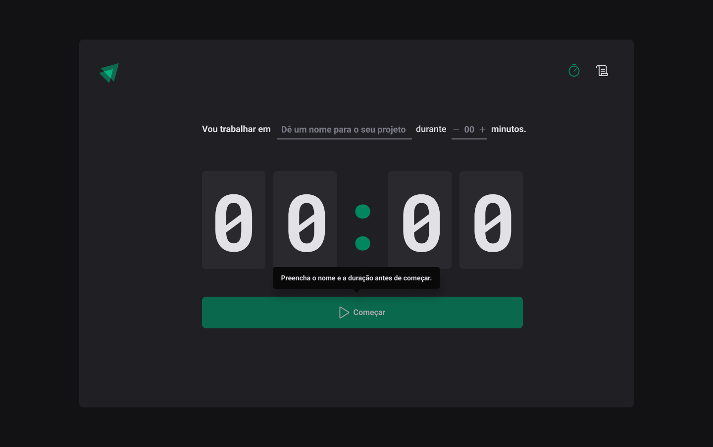

<h1 align="center"></h1>

<h3 align="center">Timer</h3>

<p align="center">“Software developers are students forever 🧠”</p>

<p align="center">
  <a href="#about">Sobre</a>&nbsp;&nbsp;&nbsp;|&nbsp;&nbsp;&nbsp;
  <a href="#install">Instalação</a>&nbsp;&nbsp;&nbsp;|&nbsp;&nbsp;&nbsp;
  <a href="#challenge">Desafios</a>&nbsp;&nbsp;&nbsp;|&nbsp;&nbsp;&nbsp;
  <a href="#technologies">Tecnologias</a>
</p>

## :speech_balloon: Sobre <a name="about"></a>

> [Timer](https://timer-douglasscaini.vercel.app/) é uma aplicação de gerenciamento de tarefas baseada em Pomodoro.

<br />
<table>
  <tr>
    <td colspan="1">Web App</td>
  </tr>
  <tr>
    <td></td></td>
  </tr>
</table>

## :warning: Instalação <a name="install"></a>

```bash
# Instalar as dependências necessárias:
$ npm install

# Iniciar o projeto:
$ npm run dev
```

## :triangular_flag_on_post: Desafio <a name="challenge"></a>

> Fixação de conceitos essenciais como Context API e Reducers.

## :heavy_check_mark: Tecnologias <a name="technologies"></a>

-   [Vite](https://vitejs.dev/guide/)
-   [React](https://pt-br.reactjs.org/)
-   [TypeScript](https://www.typescriptlang.org/)

---

by [Douglas Scaini](https://www.github.com/douglasscaini) ❤️
